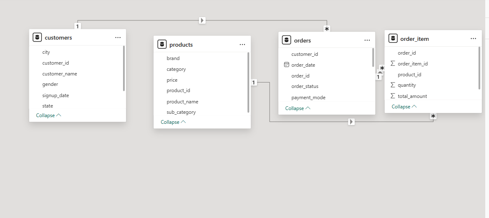

# 
# 📊 E-Commerce Sales Analytics Dashboard (Power BI)

Business Problem 

E-commerce businesses generate large volumes of transactional data, but leadership teams often lack clear visibility into sales performance, customer behavior, and revenue leakage caused by operational issues such as cancellations and returns.

## 📌 Project Overview
This project analyzes an e-commerce dataset to evaluate sales performance, customer behavior, and operational efficiency.  
The dashboard is designed with an executive-first approach and focuses on revenue growth, customer insights, and revenue leakage.

---

## 🧰 Tools & Technologies
- Power BI (DAX, Data Modeling, Visualization)
- Excel (Data validation)
- GitHub (Version control & portfolio)

---

## 📂 Dataset
- Customers
- Orders
- Products
- Order_items
  
Data covers:
- Sales transactions
- Customer demographics
- Order status (Completed, Cancelled, Returned)
- Revenue and quantity metrics

---
## 🗂 Data Model

## 📈 Dashboard Pages

### 🔹 Page 1: Sales Performance Overview
- Total Revenue, Orders, Quantity
- Monthly sales trends
- Revenue by city and product
- Payment method analysis

---

### 🔹 Page 2: Product & Customer Performance
- Product-wise revenue and quantity
- Top customers by revenue
- Repeat vs new customers
- Customer and product insights

---

### 🔹 Page 3: Operations & Revenue Leakage
- Cancellation rate
- Return rate
- Revenue lost due to cancellations and returns
- Operational risk insights

---

## 🧠 Key Insights
- A small set of products and cities drive most revenue
- Repeat customers contribute significantly higher revenue
- Cancellations cause higher revenue loss than returns
- Revenue leakage highlights operational improvement opportunities

---

## 🚀 Business Value
- Enables leadership to track KPIs in real time
- Identifies revenue leakage and fulfillment risks
- Supports data-driven decision making

---

## 🔮 Future Enhancements
- Predictive churn analysis
- Real-time data integration
- Customer lifetime value modeling
can create more professional and with problem statemnt your according

